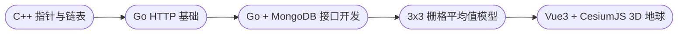

# VGE-Fresh-Tutorial — VGE团队暑期培训·组织管理与集成共享专题项目合集 (2025)

[](https://opensource.org/licenses/MIT)


> 本仓库收录 2025 年暑期培训的多语言、多栈教学项目，涵盖从 C++ 数据结构到前端 3D 可视化的完整开发链路。
> 每个模块均带有独立 README 和可运行示例，方便循序渐进学习与培训演示。

---

## 📌 培训目标

- **系统视角**：掌握从底层数据结构 → 后端接口 → 数据存取 → 模型计算 → 前端可视化的全链路。
- **工程实践**：每个项目均可独立编译运行，覆盖命令行、Web 服务、3D 前端等多种形态。
- **迁移思维**：学习可迁移的架构与通用范式，便于应用到研究课题或工程项目。

---

## 🧭 推荐学习路径



**模块对应链接**：

* [C++ 指针与链表](./cpp-linked-list)
* [Go HTTP 基础](./go-gin-http)
* [Go + MongoDB 接口开发](./mongodb-golang-interface)
* [3x3 栅格平均值模型](./raster-analysis-model)
* [Vue3 + CesiumJS 3D 地球](./vue-cesium-platform)

---

## 🗂️ 仓库结构

```
VGE-Fresh-Tutorial/
├── cpp-linked-list/              # C++ 指针与链表（含交互式链表系统）
├── go-gin-http/                  # Go + Gin 的 HTTP 基础与文件上传
├── mongodb-golang-interface/     # Go + MongoDB 的接口开发框架（含 Swagger/Postman 测试）
├── raster-analysis-model/        # 3x3 栅格平均值计算模型（Go）
├── vue-cesium-platform/          # Vue3 + CesiumJS 的 3D 数字地球演示
└── README.md                     # 本文件（顶层说明）
```

---

## 🚀 模块速览

### 1) 📂 [cpp-linked-list](./cpp-linked-list)
**定位**：掌握 C++ 指针、引用、值传递差异，危险指针演示与智能指针 RAII；实现带哨兵节点的单向链表（增删查改反转遍历）。  
**要点**：指针算术、const 正确性、安全内存操作、链表边界检查。  
**快速上手**：MSVC 2017打开工程文件, 选中一个启动方案并设置为启动项目, 编译执行

---

### 2) 📂 [go-gin-http](./go-gin-http)
**定位**：使用 Gin 框架快速构建 HTTP 服务，包括 GET 查询、POST 文件上传、静态文件访问和 302 重定向。  
**要点**：极简 API 示例，Postman / curl 测试。  
**快速上手**：
```bash
cd go-gin-http
go mod tidy
go build main.go && ./main
# 浏览器访问 http://localhost:8080/hello?name=张三
```

---

### 3) 📂 [mongodb-golang-interface](./mongodb-golang-interface)
**定位**：Go + MongoDB REST 接口开发，配套 Swagger/Postman 测试。  
**要点**：Docker 一键启动 Mongo 与可视化管理面板，标准化接口开发。  
**快速上手**：
```bash
cd mongodb-golang-interface
go mod tidy
go run main.go
# 打开 http://localhost:8080/swagger/index.html
```

---

### 4) 📂 [raster-analysis-model](./raster-analysis-model)
**定位**：3x3 栅格平均值计算模型，演示工程化数据读写与计算。  
**要点**：CLI 运行参数、日志记录、CSV 输出。  
**快速上手**：
```bash
cd raster-analysis-model
go mod tidy
go build main.go && ./main -input ./demoData/input.txt -output ./demoData/output.csv
```

---

### 5) 📂 [vue-cesium-platform](./vue-cesium-platform)
**定位**：Vue3 + CesiumJS 3D 数字地球可视化演示。  
**要点**：地形/影像/标注加载，交互控制，Cesium Ion Token 集成。  
**快速上手**：
```bash
cd vue-cesium-platform
npm install
npm run dev
# 打开 http://localhost:5173
```

---

## 🧰 通用环境要求

| 组件      | 最低版本   | 推荐版本 | 验证方式 |
|-----------|-----------|----------|----------|
| **Git** | 2.30 | 2.40+ | `git --version` |
| **C++ 编译器** | GCC 7+ / MSVC 2017+ | GCC 11+ | `g++ --version` |
| **CMake** | 3.10 | 3.20+ | `cmake --version` |
| **Go** | 1.20 | 1.21+ | `go version` |
| **Node.js** | 20.19+ / 22.12+ | LTS | `node -v` |
| **Docker** | 20.10 | 24.0+ | `docker --version` |

> 国内建议使用 npm 镜像 `https://registry.npmmirror.com` 加速安装依赖。

---

## 🧪 常见问题

- **MongoDB 无法访问** → 检查 Docker 容器网络状态与环境变量。
- **Cesium 无法加载地形/影像** → 确认 Ion Token 配置无误。
- **Go / Node 版本冲突** → 使用 LTS 版本并选择nvm重新安装依赖。

---

## 🤝 参与贡献

欢迎通过以下方式改进项目：

1. Fork 项目仓库
2. 创建特性分支 (`git checkout -b feature/改进功能`)
3. 提交更改 (`git commit -m '添加某功能'`)
4. 推送分支 (`git push origin feature/改进功能`)
5. 发起 Pull Request

---

## 📜 开源协议

本项目基于 [MIT License](https://opensource.org/licenses/MIT) 开源。

```
Copyright (c) 2025 VGE团队

特此授予任何获得本软件及相关文档文件（以下简称“软件”）副本的人免费使用本软件的权利，
包括但不限于使用、复制、修改、合并、发布、分发、再许可及/或销售软件副本，
并允许被提供软件的人这样做，条件是上述版权声明和本许可声明应包含在软件的所有副本或主要部分中。

本软件按“原样”提供，不提供任何形式的明示或暗示担保，
包括但不限于适销性、特定用途适用性及不侵权的担保。
在任何情况下，作者或版权持有人不对因软件或软件的使用或其他交易而产生的任何索赔、
损害或其他责任负责，无论是在合同诉讼、侵权行为或其他方面。
```
