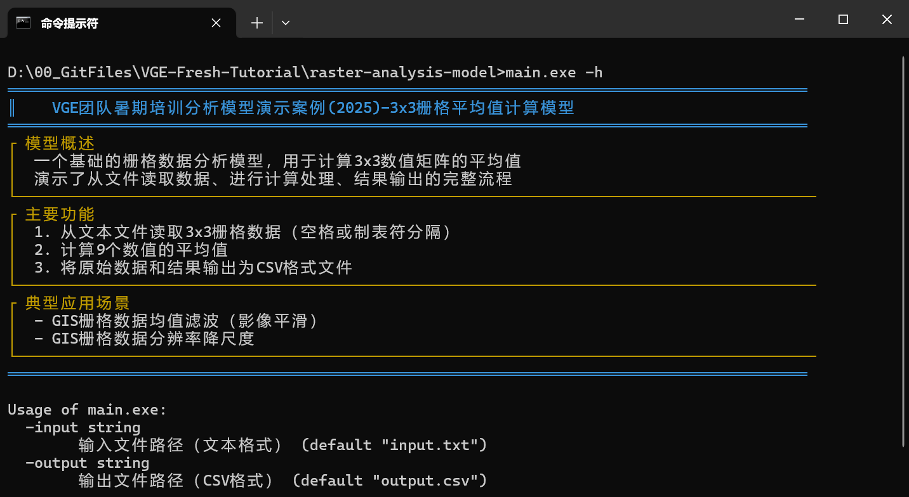
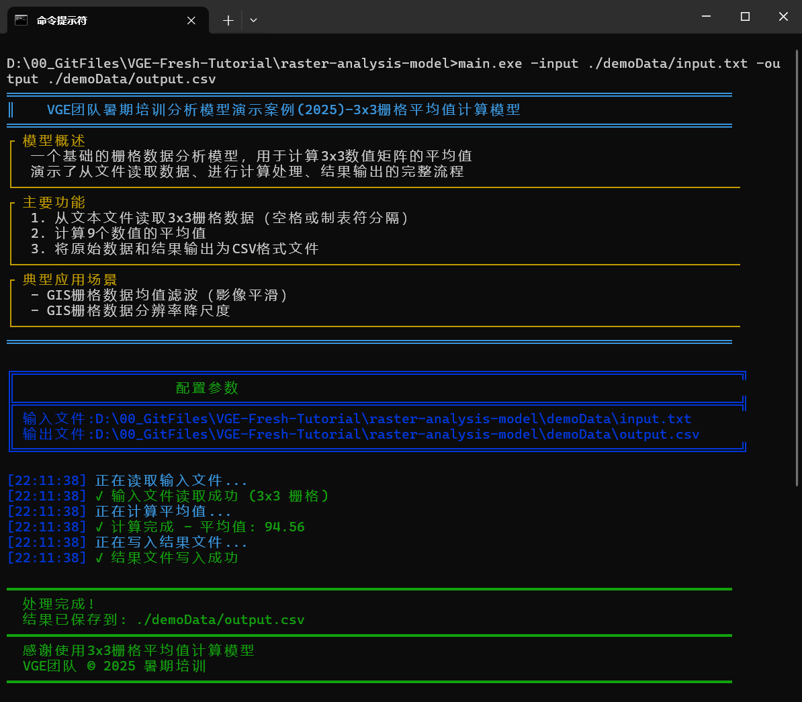

# 数据模型知识组织管理体系-以3x3栅格平均值计算模型研发为例

[](https://go.dev/dl/)
[](https://opensource.org/licenses/MIT)

## 项目概述

本教程演示了一个基础栅格数据分析模型，用于计算 3x3 数值矩阵的平均值，覆盖了从文件读取数据、计算处理到结果输出的完整流程。

- 🧠 理解基础数字孪生铁路地理地质分析模型的原理
- 🛠️ 掌握分析计算模型的核心开发流程

> **知识迁移**：该架构可扩展到其他语言实现的模型，也适用于 AI 驱动的大语言模型调用与部署场景。

---

## 🌟 核心特性

- 📁 支持文本文件输入
- 📊 精确计算 3x3 矩阵平均值
- 💾 CSV 格式结果输出
- ⏱️ 带时间戳的执行日志
- 🎨 直观的命令行界面输出

---

## 🛠️ 快速开始

### 环境准备

| 组件       | 最低版本 | 推荐版本 | 安装指南 |
|------------|----------|----------|----------|
| **Git**    | 2.30     | 2.40+    | [下载](https://git-scm.com/downloads) |
| **Golang** | 1.20     | 1.21+    | [下载](https://go.dev/dl/) |

---

### 获取代码
```bash
git clone https://github.com/DTRailway/VGE-Fresh-Tutorial.git
cd VGE-Fresh-Tutorial/raster-analysis-model
```

---

## 📂 项目结构

```
.
├── utils/               # 可视化工具包
│   └── visual.go        # 命令行界面输出组件
├── demoData/            # 示例数据文件夹
│   └── input.txt        # 示例输入文件
├── sampleImages         # 程序运行样例图
├── main.go              # 主程序入口
├── go.mod               # 依赖管理
└── README.md            # 项目文档
```

---

## ▶️ 运行程序

**安装依赖**
```bash
go mod tidy
```

**编译为可执行文件**
```bash
go build main.go
```

**查看模型信息**
```bash
main.exe -h
```
运行成功后将显示如下界面：  


**执行模型**
```bash
main.exe -input ./demoData/input.txt -output ./demoData/output.csv
```
运行成功后将显示如下界面：  


---

## 📊 查看结果

执行后将在 `output.csv` 中生成计算结果：
```csv
45.0,67.0,89.0
78.0,92.0,105.0
112.0,125.0,138.0
Average,94.56
```

---

## 📚 使用说明

### 命令行参数

| 参数       | 默认值      | 描述           |
|------------|-------------|----------------|
| `-input`   | input.txt   | 输入文件路径   |
| `-output`  | output.csv  | 输出文件路径   |

---

### 输入文件格式要求

- 必须包含 3 行 3 列的数值
- 数值之间用空格或制表符分隔
- 每行以换行符结束
- 支持格式：整数、小数、科学计数法、负数

示例：
```
1.1 2.2 3.3
4.4 5.5 6.6
7.7 8.8 9.9
```

---

## 🧪 应用场景

### GIS 栅格数据均值滤波
- 影像平滑处理
- 消除随机噪声（椒盐噪声效果较好）
- 模糊细小特征（会损失细节）

### GIS 栅格数据分辨率降尺度
- 通过局部平均值降低空间分辨率
- 例如将 2m 分辨率影像降为 6m 分辨率

---

## 🤝 参与贡献

欢迎提交 PR 或 Issue，请参考 [GitHub 官方贡献指南](https://docs.github.com/zh/contributing)

1. Fork 项目仓库
2. 创建特性分支 (`git checkout -b feature/AmazingFeature`)
3. 提交更改 (`git commit -m 'Add some AmazingFeature'`)
4. 推送到分支 (`git push origin feature/AmazingFeature`)
5. 打开 Pull Request

---

## 📜 开源协议

本项目基于 [MIT License](https://opensource.org/licenses/MIT) 开源。

Copyright (c) 2025 VGE团队

特此授予任何获得本软件及相关文档文件（以下简称“软件”）副本的人免费使用本软件的权利，
包括但不限于使用、复制、修改、合并、发布、分发、再许可及/或销售软件副本，
并允许被提供软件的人这样做，条件是上述版权声明和本许可声明应包含在软件的所有副本或主要部分中。

本软件按“原样”提供，不提供任何形式的明示或暗示担保，
包括但不限于适销性、特定用途适用性及不侵权的担保。
在任何情况下，作者或版权持有人不对因软件或软件的使用或其他交易而产生的任何索赔、
损害或其他责任负责，无论是在合同诉讼、侵权行为或其他方面。
